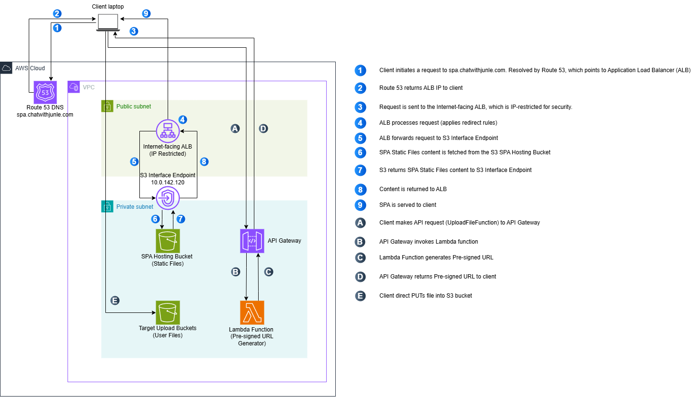

# Internal SPA Infrastructure

A Terraform-managed file management system with AWS S3 integration for internal use.

## Overview

This project provides a web application for uploading and managing files across multiple S3 buckets, featuring an admin portal for bucket operations and file management. The infrastructure is fully managed with Terraform using a modular architecture.

## Architecture Diagram


### Key Components

- **VPC Network**: Private subnets across multiple AZs with S3 VPC endpoint for secure access
- **Application Load Balancer**: External-facing ALB serving the frontend
- **Lambda Functions**: Serverless backend for file operations and bucket management
- **API Gateway**: RESTful API interface for Lambda functions
- **S3 Storage**: Primary bucket for hosting and multiple buckets for file management

## Project Structure

```
internal-spa/
├── frontend/                    # Frontend static files
│   ├── index.html              # File upload interface
│   └── admin.html              # Admin portal
├── lambda/                     # AWS Lambda functions source
│   ├── DirectS3Upload.js       # Generate pre-signed upload URLs
│   ├── AdminFileManager.mjs    # File operations (list/delete/move)
│   ├── BucketAdministrator.mjs # Bucket management
│   └── ListS3Buckets.mjs      # List available buckets
├── modules/                    # Terraform modules
│   ├── networking/             # VPC, subnets, security groups
│   ├── compute/               # Lambda functions and IAM roles
│   ├── storage/               # S3 buckets
│   ├── api-gateway/           # API Gateway configuration
│   └── load-balancer/         # ALB and target groups
├── main.tf                    # Root Terraform configuration
├── variables.tf               # Input variables
├── outputs.tf                 # Output values
├── terraform.tfvars          # Variable values
├── generated.tf.backup       # Legacy monolithic config (backup)
└── imports.tf.old           # Original import blocks (backup)
```

## Terraform Modules

### Module Structure

#### `modules/networking/`
- VPC with DNS support and hostnames
- Private subnets in multiple availability zones
- Security groups for ALB and S3 access
- S3 VPC interface endpoint for private connectivity

#### `modules/compute/`
- Lambda function packaging and deployment
- IAM roles with least-privilege policies
- Four Lambda functions for different operations

#### `modules/storage/`
- S3 bucket for frontend hosting
- Bucket policies and configurations

#### `modules/api-gateway/`
- REST API Gateway with regional endpoints
- CORS configuration for frontend domain

#### `modules/load-balancer/`
- Application Load Balancer
- Target groups with health checks
- SSL/TLS termination

### Migration Process

1. **Infrastructure Import**: Used `terraform import` blocks to bring existing AWS resources under Terraform management
2. **State Generation**: Generated initial configuration with `terraform plan -generate-config-out=generated.tf`
3. **Modularization**: Split monolithic configuration into logical modules
4. **State Migration**: Used `terraform state mv` to move resources from root to module paths

### Migration Commands Used

```bash
# Move VPC resources to networking module
terraform state mv aws_vpc.main module.networking.aws_vpc.main
terraform state mv aws_subnet.private_1a module.networking.aws_subnet.private_1a

# Move Lambda resources to compute module
terraform state mv aws_lambda_function.adminfilemanager module.compute.aws_lambda_function.adminfilemanager

# Move S3 resources to storage module
terraform state mv aws_s3_bucket.spa_bucket module.storage.aws_s3_bucket.spa_bucket

# And so on for all resources...
```

## Application Features

- **File Upload**: Drag & drop interface with direct S3 uploads via pre-signed URLs
- **File Management**: List, delete, and move files between buckets
- **Bucket Administration**: Create buckets, set policies, configure lifecycle rules
- **Secure Access**: Private network access via ALB and S3 VPC endpoint
- **Auto-Discovery**: Automatically discovers and manages buckets with `spa-s3-` prefix

## API Endpoints

### Public Endpoints
- `GET /buckets` - List available S3 buckets
- `POST /upload-url` - Generate pre-signed upload URLs

### Admin Endpoints
- `POST /admin/files` - File operations (list/delete/move)
- `POST /admin/buckets` - Bucket management operations

## Deployment

### Prerequisites
- AWS CLI configured with appropriate permissions
- Terraform >= 1.0
- Node.js runtime for Lambda functions

### Deploy Infrastructure

1. **Configure Variables**:
   ```bash
   cp terraform.tfvars.example terraform.tfvars
   # Edit terraform.tfvars with your values
   ```

2. **Initialize Terraform**:
   ```bash
   terraform init
   ```

3. **Plan Deployment**:
   ```bash
   terraform plan
   ```

4. **Apply Configuration**:
   ```bash
   terraform apply
   ```

5. **Upload Frontend Files**:
   ```bash
   aws s3 sync frontend/ s3://your-domain-name/
   ```

### Required AWS Permissions

The Lambda functions require the following S3 permissions:
- `s3:GetObject`, `s3:PutObject`, `s3:DeleteObject`
- `s3:ListBucket`, `s3:CreateBucket`, `s3:DeleteBucket`
- `s3:GetBucketPolicy`, `s3:PutBucketPolicy`
- `s3:PutLifecycleConfiguration`

## Configuration

### CORS Settings
- **Origin**: `https://spa.chatwithjunle.com`
- **Headers**: `Content-Type`, `X-Amz-Date`, `Authorization`
- **Methods**: `GET`, `POST`, `OPTIONS`

### Environment Variables
- `AWS_REGION`: Target AWS region (default: ap-southeast-1)
- `PROJECT_NAME`: Project identifier for resource naming
- `DOMAIN_NAME`: Frontend domain name

## License

MIT